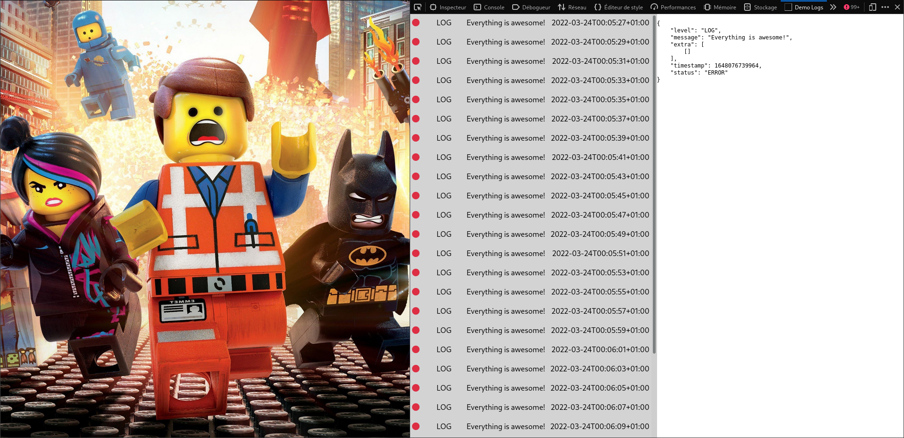

# demo

## Requirements

- Install pnpm (or prefix every pnpm command with npx, example: `pnpm i` become `npx pnpm i`)

## start demo app

```bash
cd demo/lego-website
pnpm i
pnpm dev
```

## build de web extension

```bash
cd demo/demo-logs
pnpm i
pnpm build
```

## how to use it?

- install the web extension on your browser
- open the demo website
- open the devtool panel called "Demo Logs"

## Screenshot

