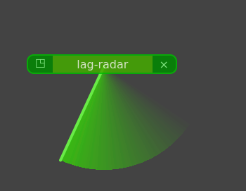
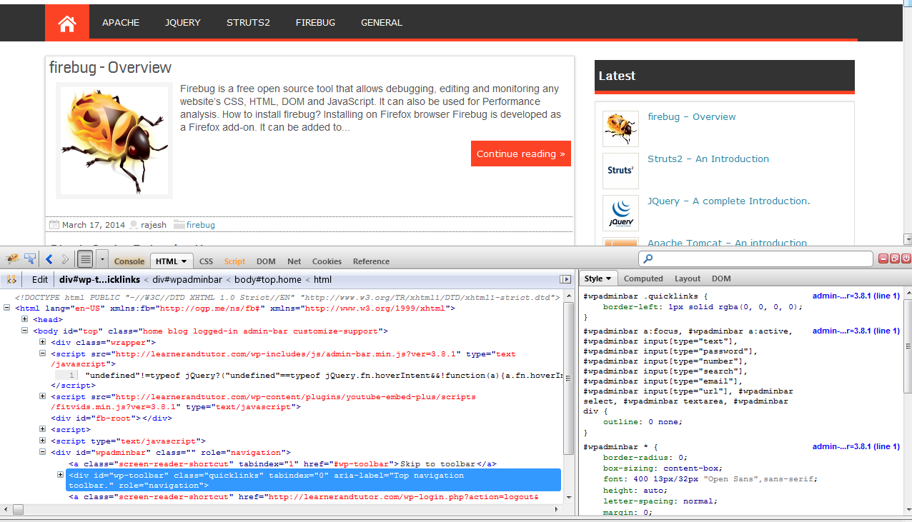
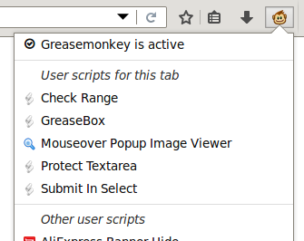

<!-- .slide: class="transition left" data-background="./assets/images/pexels-miguel-á-padriñán-one.jpeg" style="left: 600px;" -->

# L'histoire des WebExtensions

##==##

# Avant les WebExtensions

##==##

# Avant les WebExtensions : les snippets

Notes:
- Bookmarklets
    - fonction JS stockée dans un marque page

##==##

# Avant les WebExtensions : les snippets

Notes:
- Firebug
    - ancêtre des DevTools

##==##

# Avant les WebExtensions : les snippets

Notes:
- GreaseMonkey
    - système de script qui peut être joué à la demande sur une page

##==##

# Avant les WebExtensions : les snippets

<table>
    <thead>
    <tr>
        <th></th>
        <th>mise à jour</th>
        <th>portabilité</th>
        <th>documentation</th>
    </tr>
    </thead>
    <tbody>
        <tr>
            <td>Snippets</td>
            <td>❌</td>
            <td>✅</td>
            <td>❌</td>
        </tr>
    </tbody>
</table>

Notes:
- pas de mécanisme de mise à jour
- à la limite du hack
- généralement portable d'un navigateur à l'autre

##==##

# Avant les WebExtensions : les extensions

- XUL (XML User Interface Language / Firefox)
- ActiveX (IE)
- Chrome Apps

##==##

# Avant les WebExtensions : les extensions

<table>
    <thead>
    <tr>
        <th></th>
        <th>mise à jour</th>
        <th>portabilité</th>
        <th>documentation</th>
    </tr>
    </thead>
    <tbody>
        <tr>
            <td>Snippets</td>
            <td>❌</td>
            <td>✅</td>
            <td>❌</td>
        </tr>
        <tr>
            <td>Extensions</td>
            <td>✅</td>
            <td>❌</td>
            <td>😬</td>
        </tr>
    </tbody>
</table>

Notes:
- mise à jour gérée par le navigateur
- chaque navigateur a sa solution
- documenté plus ou moins bien
