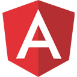
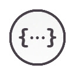

<!-- .slide: class="transition left" data-background="./assets/images/pexels-miguel-á-padriñán-two.jpeg" style="left: 700px;"-->

# WebExtensions ce standard du web

##==##

# C'est quoi une WebExtensions ?

Notes:

- Des éléments cosmétiques ou des outils
- Les WebExt sont issues des Chrome Apps

##==##

# C'est quoi une WebExtensions ?

Notes:
- Les WebExt sont standardisées par le w3c
- On utilise du html, du css et du js standard
    - avec quelques déclarations en plus (manifest.json en particulier)
- Tout est documenté sur MDN

##==##

# Versus les autres solutions ?

<table>
    <thead>
    <tr>
        <th></th>
        <th>mise à jour</th>
        <th>portabilité</th>
        <th>documentation</th>
    </tr>
    </thead>
    <tbody>
        <tr>
            <td>Snippets</td>
            <td>❌</td>
            <td>✅</td>
            <td>❌</td>
        </tr>
        <tr>
            <td>Extensions</td>
            <td>✅</td>
            <td>❌</td>
            <td>😬</td>
        </tr>
        <tr>
            <td>Web Extensions</td>
            <td>✅</td>
            <td>✅</td>
            <td>✅</td>
        </tr>
    </tbody>
</table>

Notes:
- mise à jour gérée par le navigateur
- chaque navigateur a sa solution
- documenté plus ou moins bien

##==##

<!-- .slide: class="transition" data-background="./assets/images/engrenage-2.jpeg" -->

# Un champ des possibles presque infini

##==##

<!-- .slide: class="transition" data-background="./assets/images/engrenage-1-revert.jpeg" -->

# Network

Notes:

- bloquer/modifier les requêtes
- bloquer/modifier les réponses
- ...

##==##

<!-- .slide: class="transition" data-background="./assets/images/engrenage-1.jpeg" -->

# DOM

Notes:
- ajouter/modifier/supprimer des éléments
- écouter des évènements
- ...

##==##

<!-- .slide: class="transition" data-background="./assets/images/engrenage-1-revert.jpeg" -->

# Native Messaging

Notes:
- émettre des messages vers un process sur la machine
- recevoir des messages depuis un process de la machine

##==##

<!-- .slide: class="transition" data-background="./assets/images/engrenage-1.jpeg" -->

# Panneaux lateraux (Sidebars)

Notes:
- ajouter un panneau

##==##

<!-- .slide: class="transition" data-background="./assets/images/engrenage-1-revert.jpeg" -->

# Menu contextuel

Notes:
- ajouter des menus au clic droit

##==##

<!-- .slide: class="transition" data-background="./assets/images/engrenage-1.jpeg" -->

# Devtools

Notes:
- ajouter des panneaux

##==##

<!-- .slide: class="transition" data-background="./assets/images/engrenage-1-revert.jpeg" -->

# Preferences

Notes:
- avoir une page dédiée aux préférences de notre webext

##==##

<!-- .slide: class="transition" data-background="./assets/images/engrenage-1.jpeg" -->

# ...

Notes:
- En fait tout ce qu'on peut imaginer faire dans un navigateur est accessible

##==##

<!-- .slide: class="transition" data-background="./assets/images/engrenage-2.jpeg" -->

# Quelques exemple d'extensions

##==##

# Filtrer le contenu 

Notes:
- AdblockPlus
- uBlock Origin
- Ghostery
- Https everywhere
- Decentral eyes

##==##

# Etendre le navigateur

Notes:
- Dark Reader
- Papaly
- Firefox multi-account coutainers
- Todoist
- ...

##==##

# Etendre les sites

Notes:
- Wide Github
- Refined Github
- Octotree - GitHub code tree
- LinkedIn Extension
- Call Timer for Meet
- ...

##==##

# Correction

Notes:
- Grammalecte
- Grammarly
- ...

##==##

# Intéragir avec l'OS

Notes:
- GNOME Shell Extensions
- Bitwarden
- 1Password
- KeePassXC-Browser
- ...

##==##

# Outils développeur

Notes:
- React DevTools
- Vue DevTools
- Angular DevTools
- Redux DevTools
- JSON Formatter
- ...

##==##

# Clients

Notes:
- RESTED
- ...

##==##
<!-- .slide: class="flex-row" -->

# Mention special a ...

