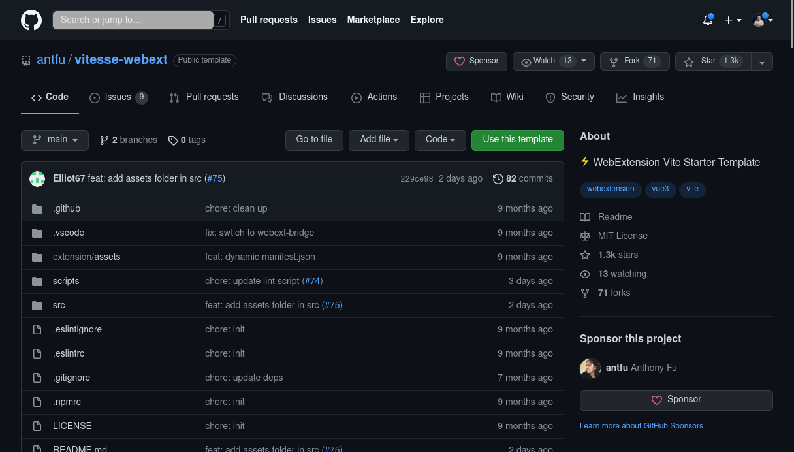
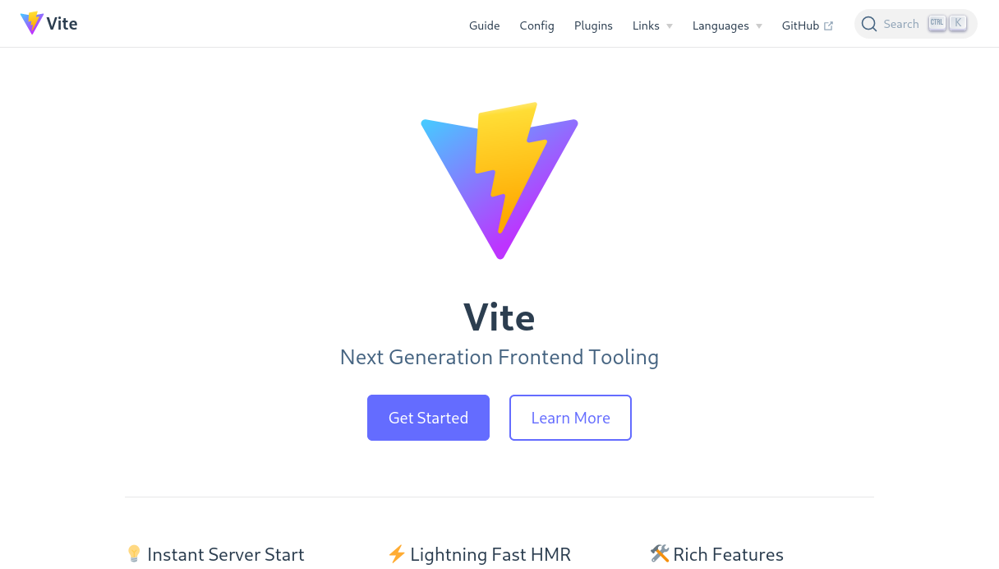

<!-- .slide: class="transition left" data-background="./assets/images/pexels-miguel-á-padriñán-five.jpeg" style="left: 700px;" -->

# Show time !

##==##

# Option 1 : Starter

Notes:
- solution qu'on a pas choisi : prendre un starter
- repo à cloner, tout est configuré
- tous les outils pour faire une extension facilement

##==##

# Option 2 : a la main

Notes:
- solution qu'on a choisi
- plus pédagogique
- on passe par les technos qu'on veut
- vitejs + react

##==##

## L'application

Notes:
- notre frontend fait des appels à une API de log
- imaginez qu'on envoit tous les logs fonctionnels dans un kibana derrière
- pas mal, mais avec les délais d'insertions dans elastic, le fait qu'on doive faire des recherches, suivre les corrélations ID, c'est pas toujours simple

##==##

## Un intercepteur de requete

Notes:
- l'idée de notre "Demo logs" c'est d'intercepter les requêtes via un background service

##==##

## Un panneau dans les devtools

Notes:
- envoyer ces requêtes à un devtool pour afficher le tout

##==##

## Et on ecrit dans un fichier

Notes:
- et on se tape même le culot de faire de l'écriture sur disque via native messaging

##==##

<!-- .slide: class="transition" data-background="./assets/images/engrenage-1-revert.jpeg" -->

# C'est partie pour le code !
